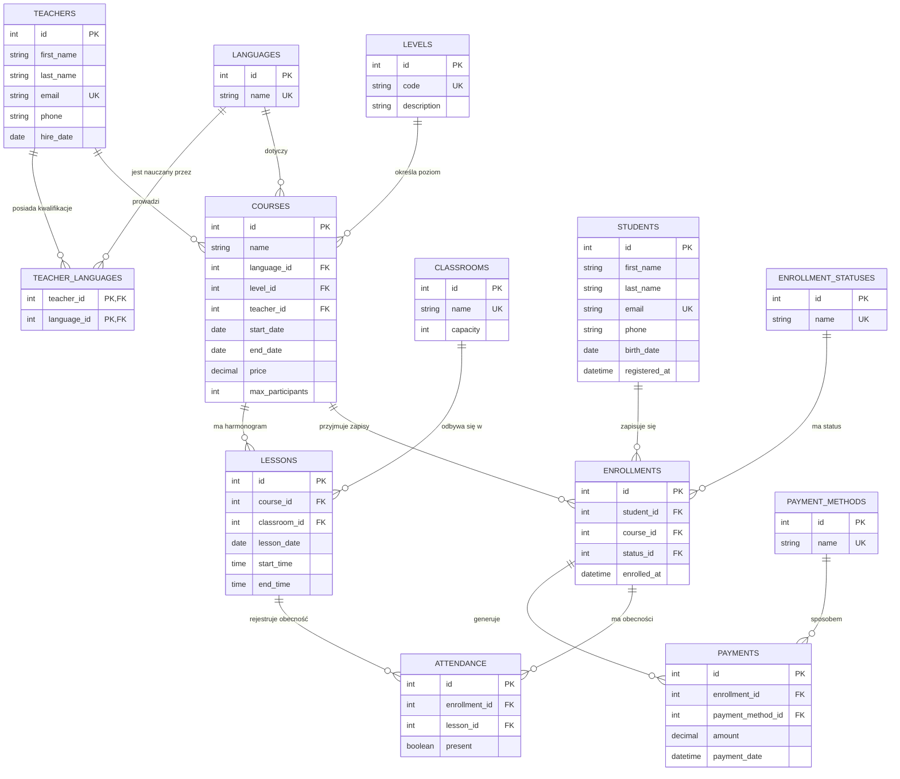

# Diagram ERD — Szkoła językowa

**Relacje:**
- `teachers` N:M `languages` (przez `teacher_languages`) — nauczyciel może uczyć wielu języków, język może być nauczany przez wielu nauczycieli
- `teachers` 1:N `courses` — jeden nauczyciel prowadzi wiele kursów
- `languages` 1:N `courses`, `levels` 1:N `courses` — kurs dotyczy jednego języka i jednego poziomu
- `courses` 1:N `lessons` — kurs ma wiele terminów zajęć
- `classrooms` 1:N `lessons` — sala ma wiele lekcji (ale nie w tym samym czasie — pilnuje tego `UNIQUE`)
- `students` N:M `courses` (przez `enrollments`) — uczeń zapisuje się na wiele kursów, kurs ma wielu uczniów
- `enrollments` 1:N `payments` — jeden zapis może mieć wiele wpłat (np. raty)
- `enrollments` N:M `lessons` (przez `attendance`) — obecność ucznia na konkretnej lekcji w ramach jego zapisu
